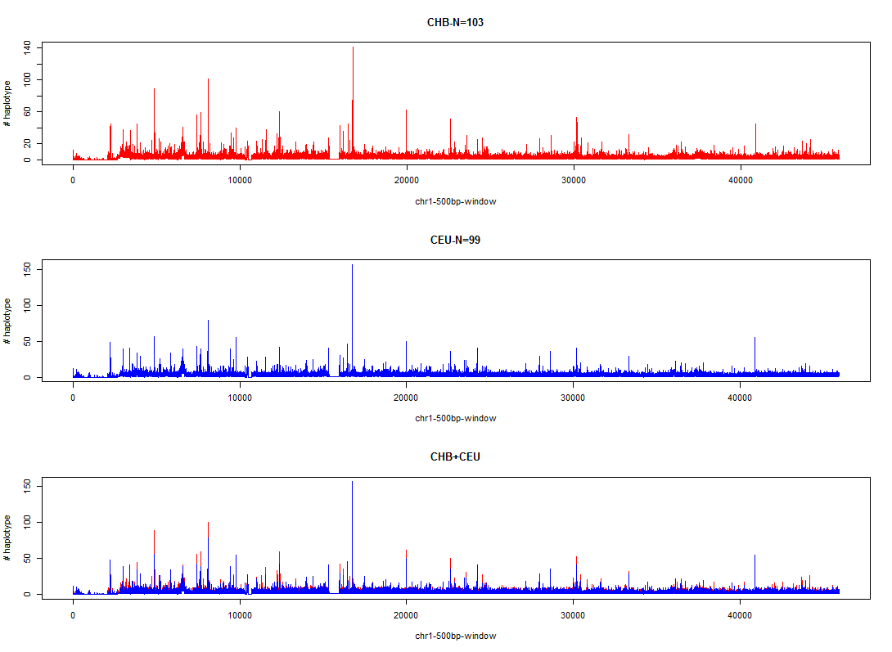
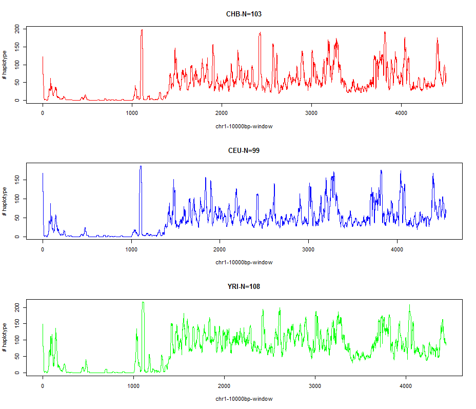

Endogenous Genetic Barcodes

We apply slide window method in which: 500bp window size and 250bp step were used to check the numbers of counts of haplotype in each genomic windows with 1000 Genome Project dataset (CHB, CEU and YSI). Take chr1 as a example, I found average number of haplotype within 500bp are 3.7 (IQR=3). Obviously, 500bp window have quite limited differentation ability with Endogenous Genetic Barcodes. It looks even with Roche 454 (700bp read length), it is not good enough for the usage.
Even 10kbp windows, the haplotype resolution is not enough for 100% ID differentiation: median=47, mean=53, IQR=42 
Therefore, we come back to identify genomic regions which is good enough for the ID differentiation with 500bp. 
